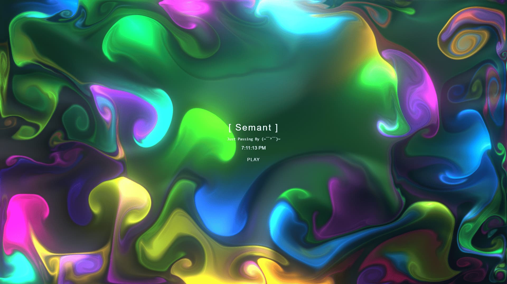

# Liquid Background Simulator

A visually pleasing **liquid background animation** built with **WebGL**, featuring smooth flowing effects and subtle interactive elements. Perfect for personal profile pages, stylish web projects, or just to enjoy some mesmerizing visuals!

## Demo

You can view the live demo here:
[Click here to try it out!](https://semant.is-a.dev/liquid)

## Features

* Real-time liquid simulation powered by WebGL shaders
* Lightweight and performant
* Responsive layout for desktop and mobile
* Customizable color theme (currently a vibrant pink/red)
* Embedded audio player with lo-fi background music
* Context menu and text selection disabled for immersive experience

## Preview



## Usage

Simply clone this repo and open `index.html` in your browser.
You can customize styles in `style.css` and scripts in `script.js`.

```bash
git clone https://github.com/s3mant/liquid.git
cd liquid
open index.html
```

## Technologies

* HTML5 + Canvas
* WebGL for rendering fluid animations
* JavaScript for audio control and interactivity
* CSS3 for styling and animations

## License

This project is open source under the [MIT License](LICENSE).

---

If you want me to generate a `LICENSE` file or add a contributor section, just say! Want it more casual, formal, or detailed?
